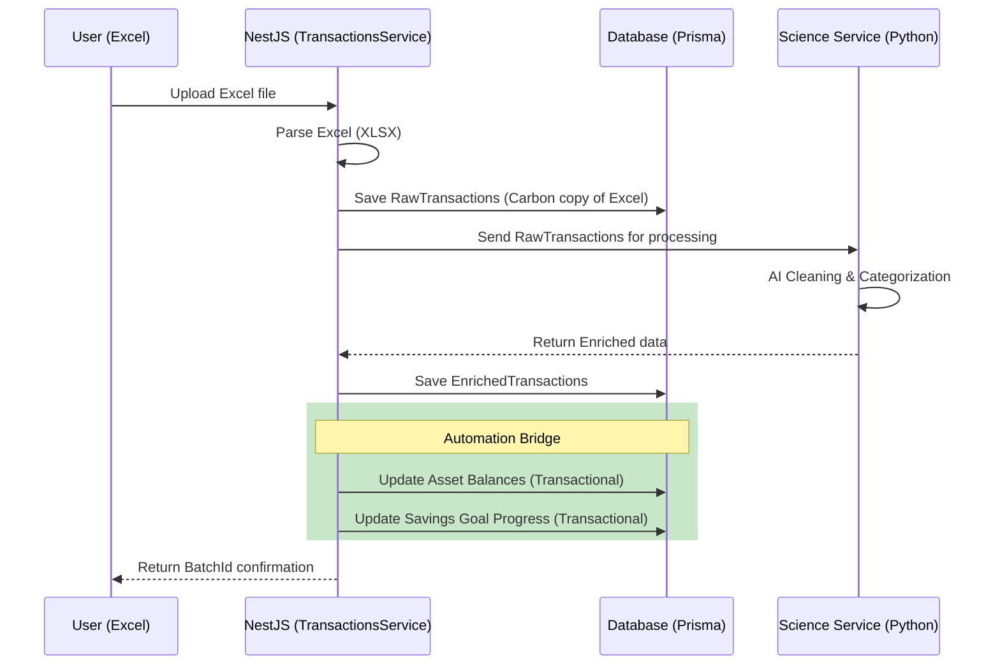

# System Architecture: Finance Dashboard

This document describes the technical architecture of the system, focusing on module interaction and data flow.

## 🏗️ Overview

The system follows a microservices (or decoupled services) architecture where the core business logic resides in a NestJS application, supported by a Python-based Data Science engine (FastAPI).

```mermaid
graph TD
    User([User/Frontend]) -- REST --> Nest[backend-core: NestJS]
    Nest -- Prisma ORM --> DB[(PostgreSQL)]
    Nest -- HTTP/JSON --> Science[backend-science: FastAPI/Python]
    Science -- Pandas/ML --> Science
```

---

## 🔄 Transaction Life Cycle

The import process is the heart of the system and goes through several validation and enrichment stages.

---

## 📂 Backend Core Components (`src/modules/`)

All business logic is strictly encapsulated within the `src/modules/` directory:

1.  **Transactions**: Handles the upload, persistence, and filtering of financial movements.
2.  **Assets**: Responsible for Net Worth calculation and historical snapshot management.
3.  **Categories**: Manages the hierarchical tree of categories and associated budget rules.
4.  **Goals**: Monitors progress toward specific savings targets and calculates ETAs via ML.
5.  **Analytics**: Aggregates data to provide KPIs and visual trends.
6.  **Automation Bridge**: Logic residing in `TransactionsRepository` that links Transactions to Assets and Goals based on Category metadata.
7.  **Science Service Wrapper**: Proxy that handles resilient communication with the Python service.

---

## 🛡️ Consistency & Precision

### ACID Transactions

Critical operations (such as creating a transaction and updating the associated account balance) are executed within **Prisma Transactions**. This ensures that the balance is never misaligned with the sum of movements.

### Decimal Precision Protocol

To avoid JavaScript floating-point errors in financial calculations, the system enforces a strict global protocol:

- **Input**: `@ParseDecimal()` decorator converts incoming strings/numbers into `Prisma.Decimal`.
- **Output**: `@SerializeDecimal()` interceptor converts `Prisma.Decimal` back into safe primitives for the frontend.
- **Enforcement**: A global `SerializeInterceptor` ensures that only explicitly exposed (`@Expose()`) properties leave the API.

---

## 🏗️ Quality Management and CI/CD

The integrity of the architecture is guaranteed by a multi-layered verification system:

- **Core Module**: 100% coverage on critical Repositories and 90%+ on Services. Verified via Jest and E2E Integrated tests.
- **Science Module**: Algorithmic validation via `pytest`.
- **Global CI/CD**: Intelligent GitHub Actions pipeline with path-filtering that ensures every change is linted, tested, and container-verified before merging.
