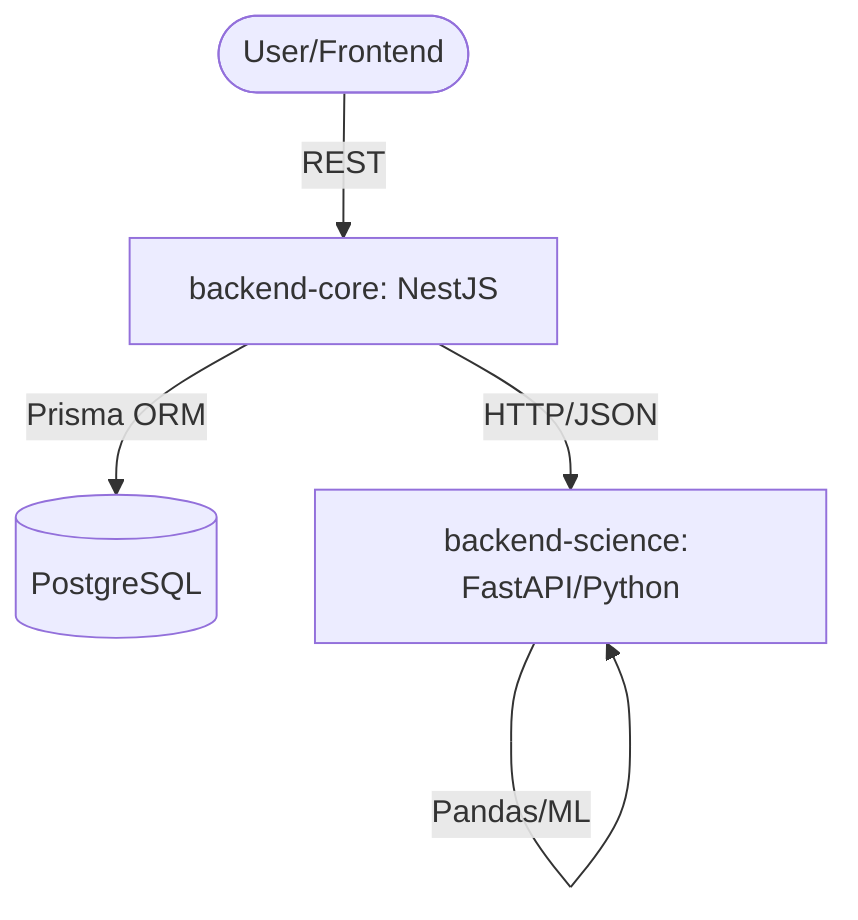
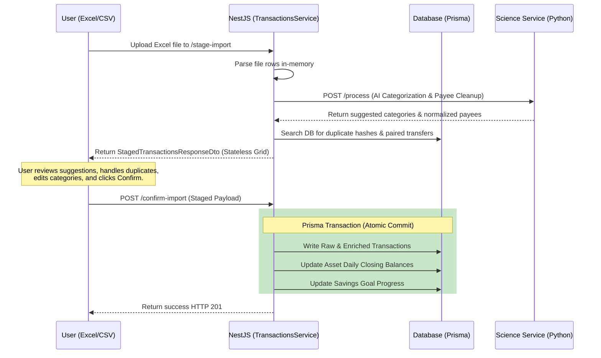

# System Architecture: Finance Dashboard

This document describes the technical architecture of the system, focusing on module interaction and data flow.

---

## 🏗️ Overview

The system follows a microservices (or decoupled services) architecture where the core business logic resides in a NestJS application, supported by a Python-based Data Science engine (FastAPI).

---

## 🔄 Transaction Life Cycle (Staging-First Flow) `[PLANNED]`

The import process does not write directly to the database. It passes through a stateless staging area for preview, validation, and de-duplication before final commitment.

---

## 📂 Backend Core Components (`src/modules/`)

All business logic is strictly encapsulated within the `src/modules/` directory:

1.  **Auth & Identity** `[PLANNED]`: Handles user registration, password hashing (bcrypt), and JWT token emission.
2.  **Transactions**: Handles manual transaction CRUD, Excel upload, and duplicate detection. Staging area parsing and HTTP `QUERY` method are `[PLANNED]`.
3.  **Assets**: Manages asset configuration, daily closing balance snapshots, and multi-currency conversions.
4.  **Categories**: Manages the hierarchical tree of categories, systemKey mapping, re-routing deletions, and budget rules.
5.  **Payees** `[PLANNED]`: Stores normalized transaction beneficiaries and their default category mappings.
6.  **Subscriptions** `[PLANNED]`: Handles explicit recurring payments, status tracking, and forecast suppression hooks.
7.  **Exchange Rates** `[PLANNED]`: Manages manual historical currency conversion rates for Net Worth charts.
8.  **Goals**: Monitors progress toward specific savings targets and calculates ETAs via ML.
9.  **Analytics**: Aggregates data to provide Net Worth, Cash Flow KPIs, and integrates linear projections from Python.
10. **Multi-Tenancy Extension** `[PLANNED]`: Intercepts ORM queries to automatically inject context `userId` isolation.

---

## 🛡️ Consistency & Precision

### ACID Transactions

Critical operations (such as creating/deleting a transaction and updating the associated account balance, or executing a staged import) are executed within **Prisma Transactions**. This ensures that the balance is never misaligned with the sum of movements.

### Decimal Precision Protocol

To avoid JavaScript floating-point errors in financial calculations, the system enforces a strict global protocol:

- **Input**: `@ParseDecimal()` decorator converts incoming strings/numbers into `Prisma.Decimal`.
- **Output**: `@SerializeDecimal()` interceptor converts `Prisma.Decimal` back into safe primitives (numbers) for the frontend.
- **Enforcement**: A global `SerializeInterceptor` ensures that only explicitly exposed (`@Expose()`) properties leave the API.

---

## 🔒 Multi-Tenant Security & Context `[PLANNED]`

Data isolation is enforced at the database query layer:
- A NestJS Guard decodes the JWT and binds the `userId` to `nestjs-cls` (AsyncLocalStorage).
- An extended Prisma Client intercepts all CRUD queries and injects the context `userId` into the `where` clause automatically.
- Raw SQL query endpoints (`$queryRaw`) bypass this extension and must manually check and interpolate the `userId` parameter.
